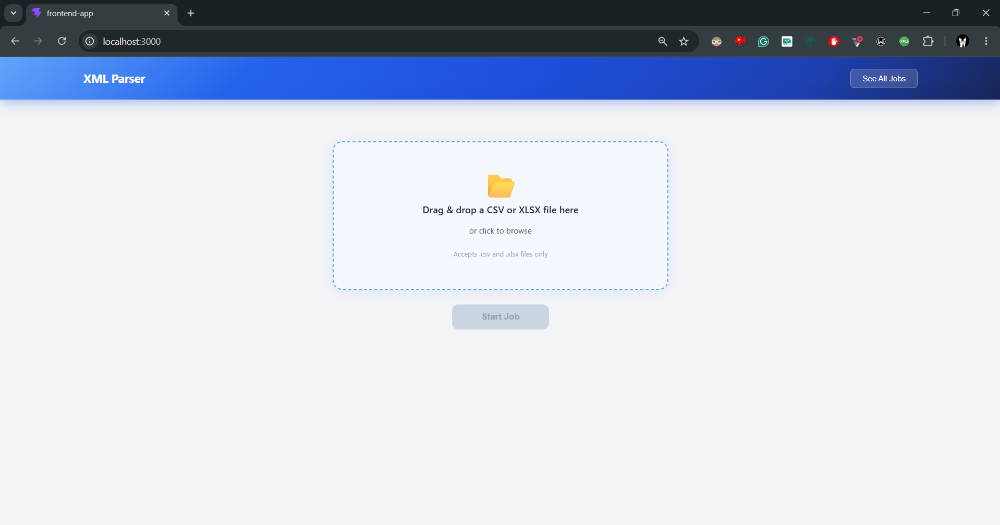
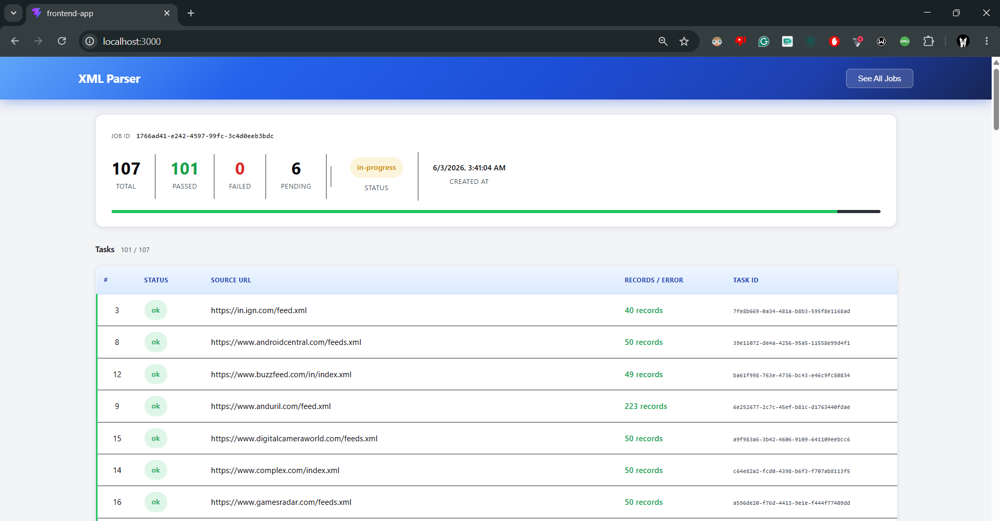
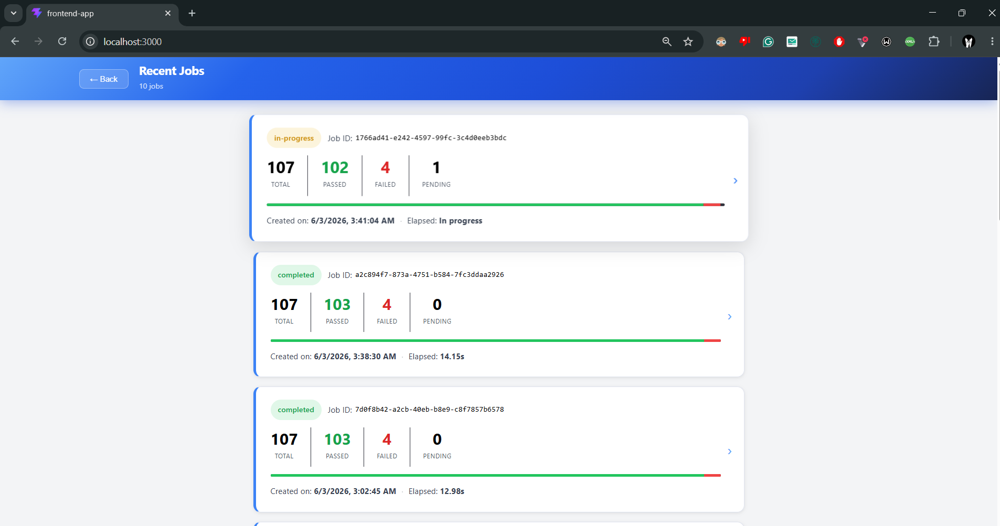
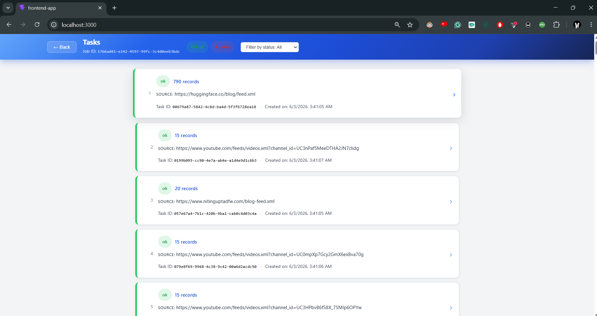
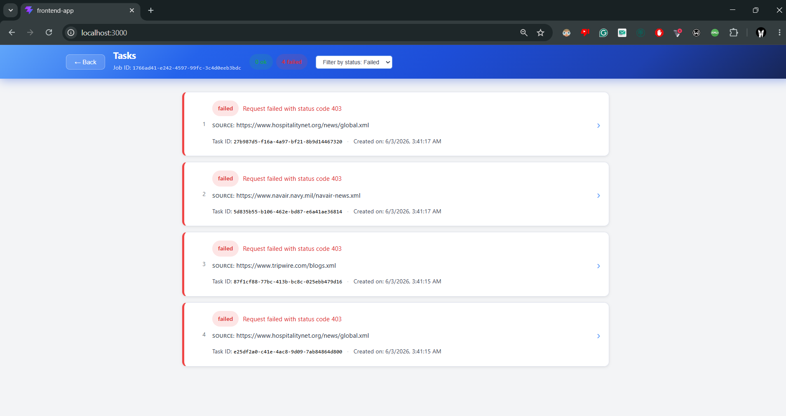
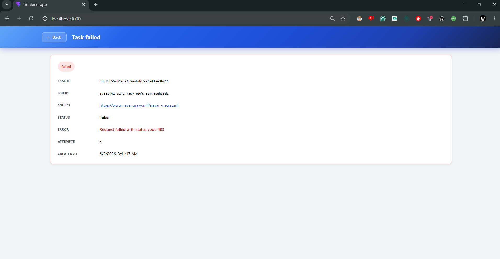
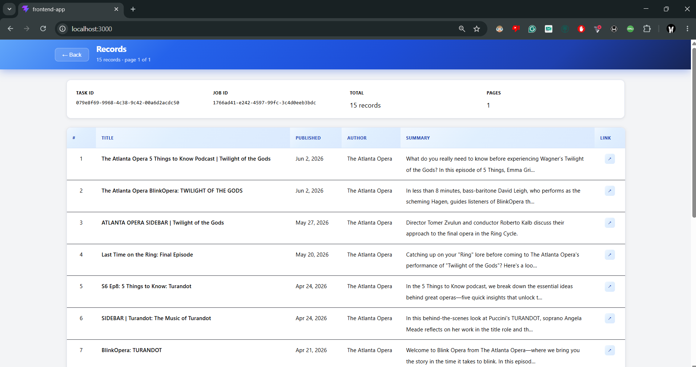

# XML Feed Processing Pipeline

## Description

A service that processes XML feeds from external sources with a dashboard for operators to monitor and debug runs. Given a list of 100 XML URLs, the backend fetches, parses, extracts structured data, and persists it to a database. The frontend lets operators trigger jobs, watch them progress in real-time, and drill into failures.

---

## How to Run

Make sure you have Docker and Docker Compose installed, then run:

```bash
docker compose up --build
```

The following will be available:

| Service | URL |
|---|---|
| Frontend dashboard | http://localhost:3000 |
| Backend API | http://localhost:1080 |

To stop all services:

```bash
docker compose down
```

---

## Architecture

The system is split into 6 containers, all orchestrated via Docker Compose.
```
┌─────────────┐        REST + SSE          ┌──────────────────┐                   ┌──────────────────┐
│   Frontend  │ ◄────────────────────────► │  Backend/Server  │ ◄───────────────► │    MongoDB       │
│  (React)    │                            │  (Node.js API)   │                   │  jobs/tasks/     │
└─────────────┘                            └────────▲ ────────┘                   │  records         │
                                                    │                             └────────▲─────────┘
                                                    │                                      │
                                                    ▼                                      │
                                           ┌──────────────────┐                            │
                                           │    RabbitMQ      │                            │
                                           └──▲──────▲──────▲─┘                            │
                              ┌───────────────┘      │      └──────────────┐               │
                              │                      │                     │               │
                              ▼                      ▼                     ▼               │
                   ┌──────────────────┐   ┌──────────────────┐  ┌──────────────────┐       │
                   │  Processor 1     │   │  Processor 2     │  │  Processor 3     │       │
                   │    (Node.js)     │   │    (Node.js)     │  │    (Node.js)     │       │
                   └────────┬─────────┘   └────────┬─────────┘  └─────────┬────────┘       │
                            │                      │                      │                │
                            └──────────────────────┴──────────────────────┘────────────────┘
```

**Flow:**

1. Operator uploads a CSV or XLSX file and then clicks "Start Job" in the dashboard.
2. The Backend/Server reads the URL list, creates a job document, creates a task document per URL, and enqueues each as a message `{ jobId, taskId, url, attempt: 0 }` to the `to_process` queue — then returns the `jobId` immediately
3. One of the three Processor instances picks up the message, fetches the XML, parses it, extracts records, and saves them to MongoDB
4. The Processor publishes a result message `{ jobId, taskId, status, records, error }` to the `processed` queue
5. Backend/Server maintains a persistent consumer on `processed` and forwards matching messages to the operator's open SSE connection in real-time

**Retry and failure handling:**

- Transient failures (network errors) are retried up to 3 times using a RabbitMQ retry queue with TTL-based backoff. Each attempt increments the `attempts` field on the task document
- After 3 failed attempts, the message is moved to the dead letter queue and the task is marked `failed`

---

## Backend Design Decisions

### Separate consumer app (`Backend/Processor`)

The processing logic lives in its own application in `Backend/Processor`, completely separate from the API server in `Backend/Server`. This was a deliberate architectural decision rather than running everything in one Node.js process.

The primary reason is **independent scalability**. The API server handles HTTP traffic and is I/O-light — it doesn't need to scale based on how many URLs are being processed. The processors are CPU and network-heavy. By separating them, you can scale the two services independently. In a cloud deployment, you point an autoscaler at the processor service alone and scale it up based on RabbitMQ queue depth.

Locally, this is expressed in `docker-compose.yml` as three separate processor services (`processor-1`, `processor-2`, `processor-3`) all built from the same `Backend/Processor` image but running as independent containers.

### API design note

The job triggering flow differs slightly from the requirement of POST /jobs API endpoint. Instead, the flow uses two endpoints: POST /upload accepts the CSV or XLSX file and stores it, then GET /parse starts the processing run and opens the SSE stream. SSE was the reason for this split. The EventSource API in browsers only supports GET requests, so the endpoint that opens the SSE connection must be a GET. Rather than separating job creation from streaming into two calls (POST /jobs to create, then GET /jobs/:id/stream to subscribe), the upload and parse steps are kept as a natural two-step flow that matches how the operator actually uses the dashboard: upload a file, then trigger processing and watch it live.

### RabbitMQ as the task queue

RabbitMQ was chosen over in-process concurrency (worker threads, Promise.all) for several reasons:

- **Durability** — messages survive processor restarts. If a container crashes mid-job, the unacknowledged message is re-queued automatically
- **Backpressure** — `prefetch: 5` per consumer means each processor holds at most 5 unacknowledged messages at a time, preventing any single instance from being overwhelmed
- **Dead letter exchanges** — RabbitMQ's native DLX support makes the retry/dead-letter pattern straightforward without custom logic. The retry queue uses `x-message-ttl` to implement backoff; expired messages dead-letter back to `to_process` automatically
- **Visibility** — the RabbitMQ management UI (port 15672) shows queue depth, consumer count, and message rates in real-time, which is useful during future development and demos


### MongoDB

MongoDB stores three collections: `jobs` (one document per processing run), `tasks` (one document per URL, with status, attempts, error, and timing), and `records` (extracted feed items linked to their task and job). The schema is document-oriented which fits the variability of XML feed structures that may be needed in the future, and MongoDB handles sparse documents gracefully.

### Logging

Each processor writes structured logs to a `log.json` file inside `Backend/Processor`. Every significant event in a task's lifecycle is logged as a JSON entry. Each log entry includes the `jobId`, `taskId`,and all other relevent details.

The log file is mounted to a shared Docker volume (`processor_logs`) across all three processor containers:


---

## Frontend Design Decisions

### Real-time updates: SSE over WebSockets and polling

Server-Sent Events (SSE) was chosen over WebSockets and polling for this use case.

**Why not WebSockets:** WebSockets provide a bidirectional channel, but job progress is strictly server-to-client. There is no case where the browser needs to push data to the server over the same connection Using WebSockets for one-directional streaming adds protocol complexity for no benefit.

**Why not polling:** Polling introduces artificial latency (a task completing 50ms after a poll fires won't be visible until the next interval), wastes requests on unchanged state, and adds server load that scales with the number of connected clients multiplied by poll frequency. With 100 tasks completing in a few seconds, polling at any reasonable interval means the progress bar moves in jumps rather than smoothly.

**Why SSE:** SSE is a plain HTTP connection that the server keeps open and writes newline-delimited JSON events to. The browser's `EventSource` API handles reconnection automatically on drop. When the job finishes, the server sends a `done` event and closes the stream. 


---

## Screenshots

**Upload page** — upload a CSV or XLSX file to start a job



**Job processing** — job details with live progress bar and task table



**All jobs** — list of recent jobs with at-a-glance status



**All tasks** — per-URL task breakdown with status and records extracted



**All tasks (filtered)** — task table filtered by status



**Failed task** — drill-down view showing error details and retry history



**All records** — paginated extracted records for a completed task



---

## Tradeoffs

| Decision | Tradeoff | What I'd do differently with more time |
|---|---|---|
| 3 fixed processor services in docker-compose | Simple and explicit — easy to see in logs and the RabbitMQ UI. But scaling requires editing the compose file rather than a single number | Use `deploy.replicas` or a proper orchestrator (Kubernetes, ECS) with autoscaling on queue depth |
| SSE per job ID | Clean isolation — each job stream is independent. But if an operator has 10 job tabs open, that's 10 persistent connections to Backend/Server | Add a multiplexed SSE endpoint (`GET /stream`) that handles all jobs on one connection, filtered client-side |


---

## Scale Analysis

### At 10x scale (1,000 URLs per job)

**Backend bottlenecks:**

- Three processors with `prefetch: 5` gives 15 concurrent tasks in flight. At 1,000 URLs this is fine. The job takes longer but nothing breaks. The bottleneck shifts to MongoDB write throughput as all three processors race to upsert records simultaneously. Connection pooling via Mongoose helps; if writes back up, add a write-optimised index strategy or batch inserts
- The `processed` queue will have up to 1,000 messages. Backend/Server's single consumer on that queue becomes the bottleneck for SSE forwarding — it processes messages sequentially. This is fine at 1,000 but worth watching
- RabbitMQ memory usage grows linearly with queue depth. At 1,000 small messages this is negligible

**Frontend bottlenecks:**

- SSE delivers 1,000 events per job. The event handler calling `queryClient.setQueryData` on every event causes 1,000 re-renders unless you debounce updates (e.g. batch into 100ms windows)

### At 100x scale (10,000 URLs per job)

**Backend bottlenecks:**

- Three processors are no longer enough. You need 20–50 processor instances to keep job duration reasonable. This is where the separate `Backend/Processor` deployment pays off. You scale it independently without touching the API
- RabbitMQ queue depth of 10,000 is still fine memory-wise but the management UI slows down. Consider increasing `prefetch` to 10–20 per processor to improve throughput
- Backend/Server's SSE forwarding loop processing 10,000 events sequentially becomes a real bottleneck. Run multiple API replicas and use a RabbitMQ fanout exchange (or Redis pub/sub) so all replicas receive all `processed` events.Each replica only forwards events matching its own open SSE connections

**Frontend bottlenecks:**

- SSE delivering 10,000 events to one browser tab will freeze the UI. Aggregate events server-side (send a summary update every 500ms rather than one event per task) or switch the job detail view to polling at a higher interval and reserve SSE for the coarse job-level status only
